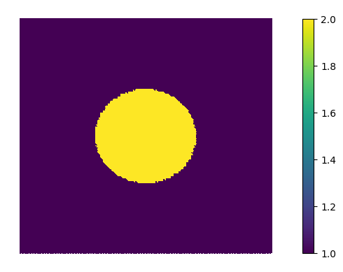
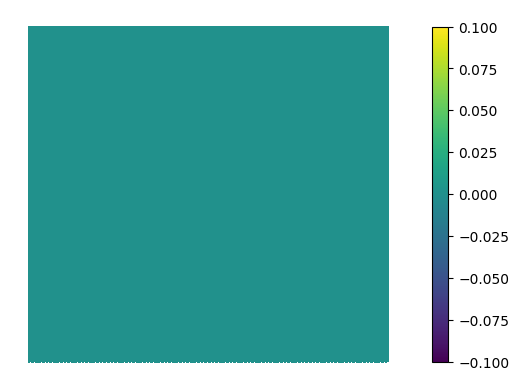

# Seismic inversion: Neural network regularisation using ExternalOperator

This repository is the official implementation of **Escaping the abstraction: a foreign function interface for the Unified Form Language [UFL]**.

## Requirements

In order to run the example, you need to have a working firedrake installation.

1) Instructions to install Firedrake can be found [here](https://www.firedrakeproject.org/download.html).

2) To install additional requirements:

  ```setup
  pip install -r requirements.txt
  ```

## Seismic inversion example

The seismic inversion can be run via the `seismic_inversion.py` file. When running the file you can specify:

- `regulariser`: An integer indicating the type of regularisation to take into account: (0: No regularisation, 1: Tikhonov, 2: Neural network)
- `scale_noise`: Scale factor applied on the noise to make the observed data from the exact solution.
- `alpha`:  Regularisation factor

Run the command:

```seismic_run
python seismic_inversion.py -regulariser {regulariser} -scale_noise {scale factor} -alpha {regularisation factor}
```

You can reproduce the figures of the article via:

```seismic_run
python seismic_inversion.py -regulariser 0 1 2
```

Here are the corresponding figures:

<p float="left">
  
  
</p>

<p float="left">
  
  
  <figcaption align = "center"><b>Velocity obtained with: Exact solution (upper left), neural network regularisation (upper right), Tikhonov regularisation (lower left), no regularisation (lower right)  </b></figcaption>
</p>

